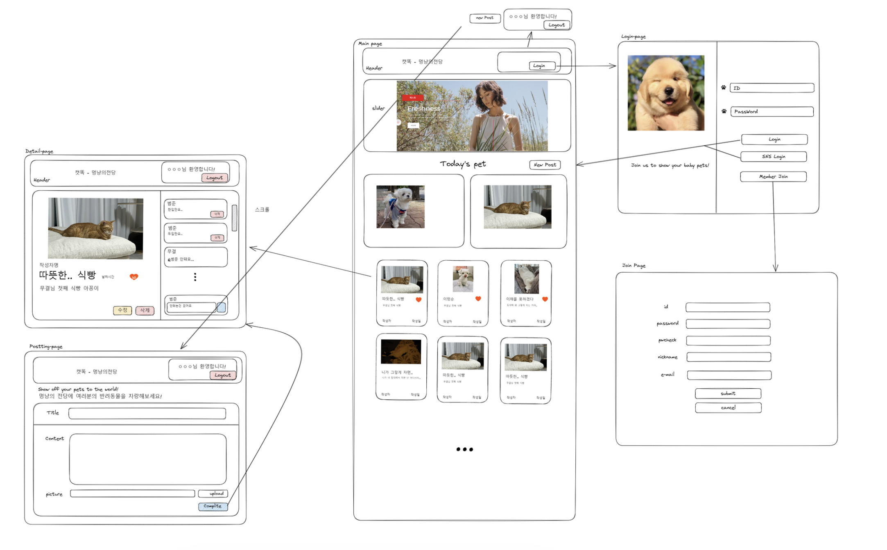
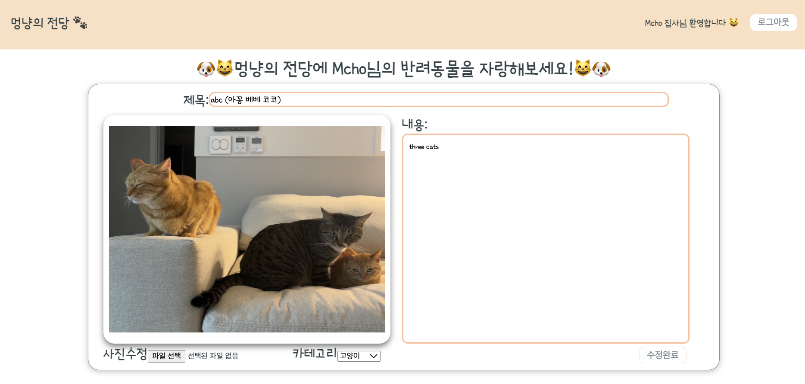

## 프로젝트 이름 : 멍냥의 전당

## 프로젝트 설명

반려동물의 사진과 함께 자랑글을 올리는 웹사이트로 맘에 드는 게시글에 댓글과 좋아요를 할 수 있습니다. 가장 좋아요를 많이 받은 게시물은 Today’s pet에 오르는 영광을 가집니다.

## 개발

- 조무결 [mugyeol](https://github.com/mugyeol)
- 백재현 [elderanni](https://github.com/elderanni)

### Note

- kakaoLogin
  서버쪽에서 카카오에 token 요청시 전달하는 redirectUri 주소를 클라이언트 ip에 맞춰야 실행됨.
  (현재 프론트 배포된 ip로 되어 있음)

- 에러 핸들링은 대부분 alert처리만 해준 상태. 안된 부분도 있음.

### 개선할 사항

무결

- styled컴포넌트 엘리먼트를 너무 한정된 숫자로 재사용 하려다보니 props가 너무 복잡해졌다.
- 그러다보니 간단한 레이아웃 작업을 하면서도 신경을 너무 많이 쓰게 되었다.
- 결국 나중에 한번 정리를 하기로 하고, 속도를 내기 위해 엘리먼트들을 재사용 하는 대신 각 컴포넌트에서 그냥 엘리먼트를 하나씩 만들면서 사용했다.
- 그러면서 어떤 종류들을 모듈화 시키면 좋을지 생각해 보았다.
- 다음 프로젝트에서 적용해봐야겠다.
- 그런 엘리먼트들을 정착 시켜서 나만의 엘리먼트 셋팅을 만들어 두어야 할 것 같다.
- 그런데 쓰다보니까 검색해보면 많이 나올 것 같다..

### 배운 점

#### 무결

#### dataManger

- dataManger라는 폴더를 만들어서 query, apiConfig, message 등을 관리했다.
- 데이터! 하면 찾아갈 곳이 생겨서 편리하고 든든했다.

#### 컴포넌트 별 funcs폴더

- 작업을 하다 보면 특정 컴포넌트에서만 쓰게 될것 같은 함수가 있다.
- 이렇게 사용처가 비교적 분명하고 일회성일 확률이 높은 함수들은 상위에 utility같은 폴더를 만들어서 관리하는 것보다는
  컴포넌트 폴더 안에 관련된 폴더 혹은 파일을 만들어서 관리하면 좋은 것 같다.

## 와이어프레임

## 회원가입 페이지

## 로그인 페이지

## 메인 페이지

## 상세페이지

## 작성(수정) 페이지

